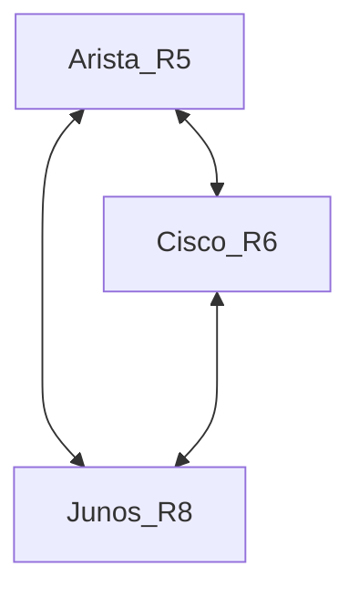

# segment-routing-all-ven

Repository for segment routing with all vendor configurations.

## Topology

## Overview

This repository contains configuration examples and show commands for segment routing across multiple network vendors, including Arista, Cisco IOS-XR, and Juniper.

## Contents

- `config.md`: Configuration snippets for Arista, Cisco IOS-XR, and Juniper devices, including topology diagrams and SRGB/Node-SID assignments.
- `show-commands.md`: Useful show commands for verifying segment routing, IS-IS adjacencies, and MPLS operations.

## Topology

The network topology and loopback IPs are documented in `config.md` using a Mermaid diagram for easy visualization.

## Usage

Use the configuration files as references for setting up segment routing in multi-vendor environments. Each section is clearly marked for the respective vendor, and includes interface, IS-IS, and segment routing configurations.

## Contributing

Contributions are welcome! Please open an issue or submit a pull request for any updates, corrections, or additional vendor configurations.

## License

This project is licensed under the MIT License.
