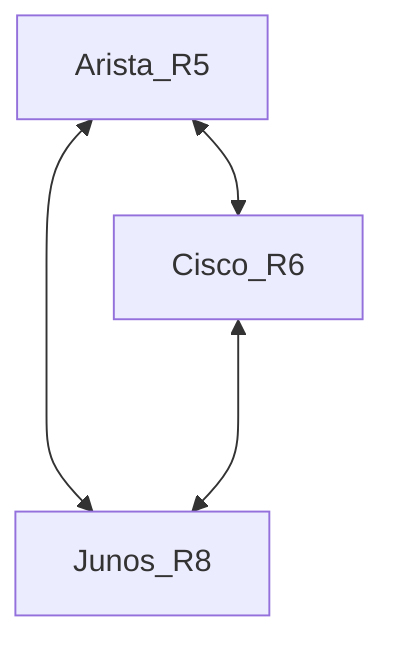

## 
This document shows the topology & the required configuration for isis and segment routing.

## Topology


## Loopack IP's
- Arista_R5 - 172.0.0.5
- Cisco_R6 - 172.0.0.6
- Junos_R8 - 172.0.0.8

### Node-SID's
- Arista_R5 - 45
- Cisco_R6 - 46
- Junos_R8 - 48

### SRGB Range
```
SystemId         Base     Size
-------------- ------------ -----
      R5       900000    65536
      R6        16000     8000
      R8        16000     8000
```
## Arista
```
interface Ethernet2
   description R6:Gi0-0-0-2
   no switchport
   ip address 10.56.0.5/24
   ipv6 enable
   ipv6 address 2000:abcd:56::5/64
   isis enable 1
   isis network point-to-point
!
interface Ethernet4
   description R8:eth4
   no switchport
   ip address 10.58.0.5/24
   ipv6 enable
   ipv6 address 2000:abcd:58::5/64
   isis enable 1
   isis network point-to-point
!
interface Loopback0
   ip address 172.0.0.5/32
   ipv6 address abcd::5/128
   node-segment ipv4 index 45
   node-segment ipv6 index 65
   isis enable 1
   isis metric 1
   isis passive
!
ip routing
!
ipv6 unicast-routing
mpls ip
!
router isis 1
   net 49.0001.0000.0000.0005.00
   is-hostname R5
   router-id ipv4 172.0.0.5
   is-type level-2
   !
   address-family ipv4 unicast
   !
   address-family ipv6 unicast
   !
   segment-routing mpls
      no shutdown
!
end
```

## Juniper
```
set chassis network-services enhanced-ip
set interfaces ge-0/0/2 unit 0 family inet address 10.68.0.8/24
set interfaces ge-0/0/2 unit 0 family iso
set interfaces ge-0/0/2 unit 0 family inet6 address 2000:abcd:68::8/64
set interfaces ge-0/0/2 unit 0 family mpls
set interfaces ge-0/0/3 unit 0 family inet address 10.58.0.8/24
set interfaces ge-0/0/3 unit 0 family iso
set interfaces ge-0/0/3 unit 0 family inet6 address 2000:abcd:58::8/64
set interfaces ge-0/0/3 unit 0 family mpls
set interfaces lo0 unit 0 family inet address 172.0.0.8/32
set interfaces lo0 unit 0 family inet6 address abcd::8/128
set routing-options router-id 172.0.0.8
set protocols isis interface ge-0/0/2.0 point-to-point
set protocols isis interface ge-0/0/3.0 point-to-point
set protocols isis interface lo0.0 level 2 metric 1
set protocols isis source-packet-routing srgb start-label 16000
set protocols isis source-packet-routing srgb index-range 8000
set protocols isis source-packet-routing node-segment ipv4-index 48
set protocols isis source-packet-routing node-segment ipv6-index 68
set protocols isis level 1 disable
set protocols isis net 49.0001.0000.0000.0008.00
set protocols mpls interface ge-0/0/2.0
set protocols mpls interface ge-0/0/3.0

```

Cisco IOS-XR
```
interface Loopback0
 ipv4 address 172.0.0.6 255.255.255.255
 ipv6 address abcd::6/128
!
interface GigabitEthernet0/0/0/2
 description R5:eth2
 ipv4 address 10.56.0.6 255.255.255.0
 ipv6 address 2000:abcd:56::6/64
!
interface GigabitEthernet0/0/0/3
 description R8:eth3
 ipv4 address 10.68.0.6 255.255.255.0
 ipv6 address 2000:abcd:68::6/64
!
router isis 1
 is-type level-2-only
 net 49.0001.0000.0000.0006.00
 address-family ipv4 unicast
  metric-style wide
  segment-routing mpls
 !
 address-family ipv6 unicast
  metric-style wide
  single-topology
  segment-routing mpls
 !
 interface Loopback0
  passive
  address-family ipv4 unicast
   metric 1
   prefix-sid index 46
  !
  address-family ipv6 unicast
   metric 1
   prefix-sid index 66
  !
 !
 interface GigabitEthernet0/0/0/2
  circuit-type level-2-only
  point-to-point
  address-family ipv4 unicast
   metric 10
  !
  address-family ipv6 unicast
   metric 10
  !
 !        
 interface GigabitEthernet0/0/0/3
  circuit-type level-2-only
  point-to-point
  address-family ipv4 unicast
   metric 10
  !
  address-family ipv6 unicast
   metric 10
  !
 !
!
mpls oam
!
```