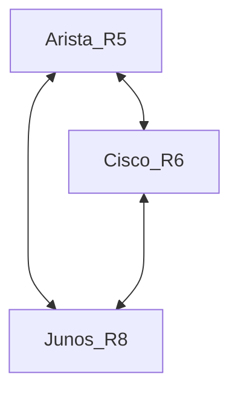

This document includes the commands that can be used to troubleshoot segment-routing config's from different vendors'.

## Topology



## Juniper 
```
show isis overview
show isis adjacency
show isis database
show isis database extensive 
show isis database R8.00-00 extensive | match range
show route table inet.3
show route table inet.3 172.0.0.5/32 detail
show route table mpls.0 label 16045 detail
show route table inet.0 172.0.0.5/32
show route table inet.0 172.0.0.5/32 detail
ping 172.0.0.5 source 172.0.0.8
ping mpls segment-routing isis 172.0.0.5/32 source 172.0.0.8/32
```
## Arista

```
show isis adj
show isis database
show isis database R5.00-00 detail
show isis segment-routing
show isis segment-routing global-blocks
show isis segment-routing prefix-segments
show isis segment-routing adjacency-segments
show mpls segment-routing bindings
show ip route 172.0.0.8/32
show mpls lfib route 172.0.0.8/32
ping mpls segment-routing isis ip 172.0.0.8/32 source 172.0.0.5
```